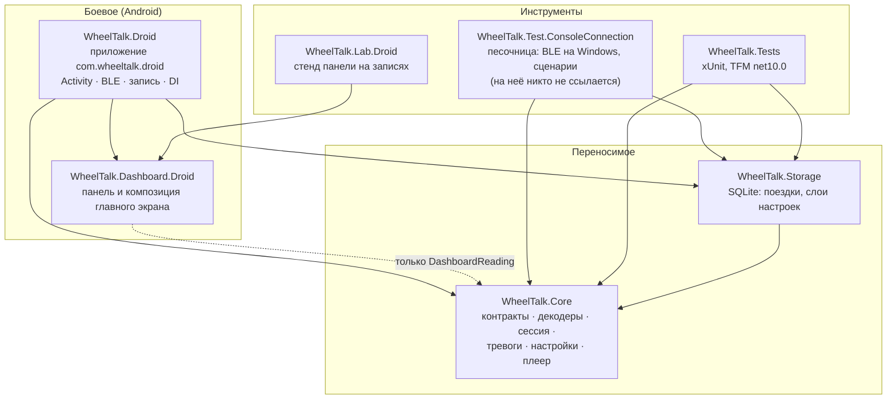
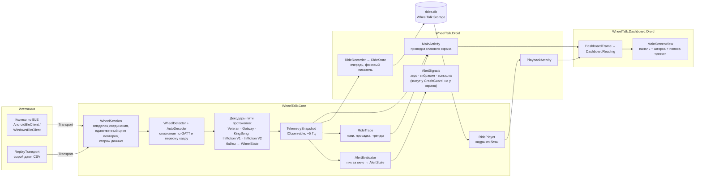
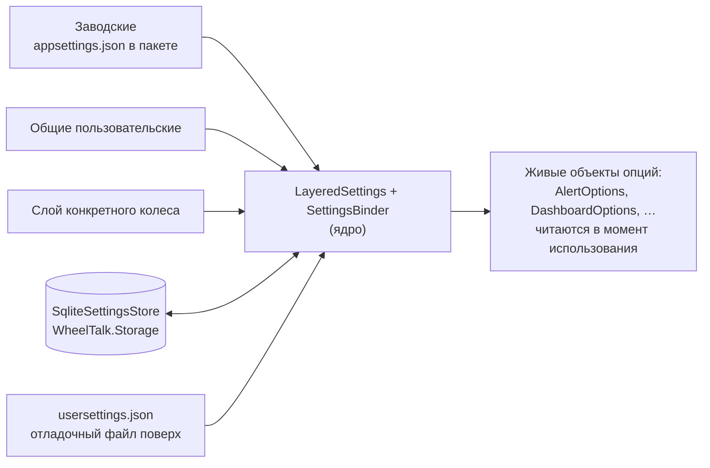

# Архитектура — карта проектов и поток данных

> Снимок на 01.08.2026, по ревью архитектуры ([план 19](android-plan-19-ui-seams.md)).
> При расхождении с кодом прав код; сюда вносить правки тем же коммитом, что двигает границы.

## Проекты и зависимости

Стрелка — «ссылается на». Ядро не знает ни про Android, ни про Windows, ни про SQLite —
это проверяется компилятором (TFM `net10.0` без платформенных суффиксов).

Ключевое свойство: **`Dashboard.Droid` не знает про сессию, транспорт и базу** — панель кормят
record'ом `DashboardReading`, и поэтому один и тот же класс экрана (`Screen/MainScreenView`)
показывают и боевое приложение, и стенд на записанной поездке.

## Поток данных: от байтов до экрана

Команды идут обратным ходом: шторка → `WheelSession.SendCommand` → `SequentialWriteQueue`
(одна GATT-запись в полёте) → декодер строит кадр протокола → транспорт. Отказ без связи —
исключение, а не молчаливый успех.

## Настройки — три слоя

Пороги тревог панель читает **источником**, а не копией: `DashboardOptions.Thresholds` — это
интерфейс `IDashboardThresholds` (план 19 Б3); приложение отдаёт реализацию поверх живого
`AlertOptions`, стенд крутит мутабельное умолчание своими ручками. Тем же приёмом след поездки
читает сглаживание (`RideTrace.SmoothingSecondsSource`, план 19 Б5) — зеркалирования по кадру
нет нигде.

## Внутри проектов: где что решается

Переехало из `AGENTS.md` «Структура кода» 03.08.2026 — там осталась строка на проект.

### `WheelTalk.Core` — контракты, порты, декодеры, сервисы

Никаких `Windows.*`/Android-зависимостей. Изначально был папкой `WheelTalk/Core/` внутри консоли;
выделен в отдельный проект, чтобы независимость проверялась компилятором, а не соглашением.
Namespace при выделении не менялся (`WheelTalk.Core.*`) — правка `using` по всему решению ничего
бы не дала.

- `Decoding/IWheelDecoder.cs` — контракт каждого протокольного декодера: `Decode`, `IsReady`,
  командные `Build*` и событие `WriteRequested` — для декодеров, которым нужно писать в транспорт
  **по собственной инициативе**, не в ответ на команду пользователя (у Gotway/Begode это
  handshake-опрос "V"/"N" и отложенная вторая половина двухшаговых команд, у KingSong — реактивный
  запрос имени/серийника после каждого кадра, у InMotion V1/V2 — непрерывный поллинг на таймере,
  живущий всё соединение). `InMotionDecoder`/`InMotionDecoderV2` — единственные, кто реализует ещё
  и `IDisposable`: их таймер должен быть остановлен явно, `WheelService.Dispose` зовёт его, если
  декодер реализует интерфейс.
- `Services/Decoder.cs`, `WheelService.cs` — протокол-агностичны, работают через `IWheelDecoder`.
  Какой декодер выбрать — `Contracts/WheelProtocol.cs` (enum) + `Decoding/WheelDecoderFactory.cs`:
  **единственный маппинг протокол → декодер**, им пользуются и composition root консоли, и
  `DecoderHarness` тестов, и Android-приложение.
- `Services/WheelSession.cs` — владелец соединения: строит state/декодер/`WheelService` на каждое
  подключение (переиспользовать нельзя — `WheelState` копит и не сбрасывается). **Повторы живут
  только здесь.** Транспорт спрашивают ровно один раз за попытку, и он обязан честно сообщить об
  отказе исключением, а не пытаться сам: два независимых механизма поверх одного соединения — это
  то, из чего на выходе 28.07.2026 вырос шторм переподключений (одна погоня давала три коннекта,
  каждый мог поднять `ConnectionLost` и попросить ещё одну). Политика — `ConnectionOptions`: пауза
  стартует с `FirstRetryDelay` (0,5 с — хватает, чтобы разошёлся полуоткрытый линк) и удваивается
  до `RetryDelay` (5 с), чтобы выключенное колесо не долбили каждые полсекунды и лог не тонул.
- `Ports/SequentialWriteQueue.cs` — очередь GATT-записей: одна команда в полёте, следующая — по
  подтверждению доставки, отказ «занято» повторяется, а не теряется молча. Через неё же безопасно
  ходят двухшаговые команды Gotway.
- `Services/RideTrace.cs` — факты о поездке, которых нет ни в одном отдельном снимке: куда движется
  ШИМ и где он только что был, просадка пака под нагрузкой, максимумы за поездку. Накапливается
  кадр за кадром, проверяется тестами, а не глазами на телефоне.
- `Playback/RidePlayer.cs` — проигрыватель записанной поездки из базы: пуск, пауза, перемотка,
  скорость. Отдаёт те же `TelemetrySnapshot`, что живое колесо, поэтому панель работает без единой
  правки; декодеру в этой цепочке делать нечего — в отличие от `ReplayTransport`.
- `Settings/` — три слоя (см. выше) и механика описаний. `LayeredSettings` — единственная
  нетривиальная логика; плюс «использовать значение по умолчанию» и «перезаписать значение по
  умолчанию» (последняя снимает переопределение, иначе оно останется вторым экземпляром того же
  значения). `SettingDescriptor` описывает настройку — где лежит, как выглядит, когда показывается;
  `SettingsBinder` держит **живые** объекты настроек в согласии со слоями: заменять их нельзя, в них
  пишут декодеры. Числа описываются в тех единицах, в которых показываются (50,0 км/ч, а не 500),
  пересчёт — только в двух делегатах описания. Хранилище — за портом `ISettingsStore`.
- `Alerts/` — `AlertEvaluator` строит `IObservable<AlertState>` цепочкой Rx поверх телеметрии.
  Считает **пик за скользящее окно**, а не последнее значение: одиночный всплеск ШИМ между кадрами
  обязан сработать, а пустое окно (кадры прекратились) само гасит тревогу. Пороги — `AlertOptions`,
  интенсивность 0..1 между двумя уставками; как это звучит и выглядит — дело приложения.

Настройки и хранилище лежат в переносимых проектах ещё и потому, что `WheelTalk.Tests` не может
сослаться на `net10.0-android`: всё написанное внутри приложения не проверяется ничем.

### `WheelTalk.Storage` — база поездок

`Microsoft.Data.Sqlite`, SQL руками (ORM тут нечего делать: таблиц шесть, запросов пяток). В ядре
ему не место — оно нарочно переносимое, и SQLite разменял бы эту переносимость.

- `Schema.cs` — DDL по версиям; версия живёт в `PRAGMA user_version`. **Уже написанную миграцию не
  правят** — на телефоне в этом файле лежат записанные поездки, единственные данные, которых нет
  больше нигде.
- `RideDatabase.cs` — открытие, миграция, WAL и все решения о плохом файле: нечитаемый
  **переименовывается рядом, а не удаляется**; файл от более новой сборки не пишется
  (`IsWritable = false`). Он же при старте закрывает поездки, которые приложение не успело закрыть,
  — по времени последней строки.
- `RideStore.cs` — запись. Смысл класса в том, на каком потоке он **не** работает: телеметрия
  приходит с GATT-колбэка, и коммит WAL с тремя индексами там не место. `Write` только кладёт в
  очередь, один фоновый цикл владеет соединением и пишет пачками в транзакции. Осушение `alert`
  (это колонка `telemetry`, а не таблица: последнее виденное значение пишется только в строку, где
  сменилось, иначе оно повторялось бы до следующей тревоги), смена колеса и медленные таблицы —
  тоже здесь, иначе они разъедутся с записью.
- `RideExporter.cs` — чтение поездки обратно в CSV. Формат **не решается здесь**: его владелец —
  `RideLog` в ядре, а экспорт лишь восстанавливает снэпшот и отдаёт его. Поэтому расхождение с
  файлом, записанным с колеса, — всегда ошибка чтения базы, и тест говорит именно это.

### `WheelTalk.Test.ConsoleConnection` — песочница

Продуктом не является: **на неё не ссылается ни один проект**, включая тесты (с 02.08.2026).
Переименована из `WheelTalk` тогда же — прежнее имя выглядело как главный проект решения;
пространства имён остались прежними (`WheelTalk.Ble`, `WheelTalk.Debug`, …).

- `Ble/WindowsBleClient.cs` — `ITransport` поверх `Windows.Devices.Bluetooth`: держит `GattSession`
  открытой (`MaintainConnection = true`) и ретраит GATT-discovery. Это повтор **одной операции
  внутри попытки**, а не повтор подключения (тот только в сессии) — подробности и дальнейшие шаги
  отладки Begode в `AGENTS.md` «Пять протоколов».
- `Debug/` — `ConsolePresenter`, `LoggingEventSink`, `TelemetryCsvWriter`, `TestHarness` со
  сценариями. `PwmModelReport` (сверка формулы ШИМ по записанной поездке, план 9 фаза 2) переехал в
  `WheelTalk.Tests/Prediction/`: консоль им не пользовалась.
- `Configuration/` — `WheelTalkOptions` (весь раздел `"WheelTalk"` одним объектом: `WheelAddress`,
  `Protocol`, `WheelConfig`) и `AppWheelConfig` (POCO `IWheelConfig`; у каждого хоста своя копия —
  у тестов в `TestSupport/`, у приложения своя). Значения не валидируются при биндинге:
  `WheelAddress` проверяется в `WindowsBleClient.MacToAddress` при подключении, иначе
  пустой адрес ломал бы сценарий `Scan`, которым его и узнают.
- `Composition/` — DI двумя кусками: `AddWheelTalkOptions` (биндинг конфига; `IWheelConfig`
  отдаётся тем же инстансом, в который декодеры пишут reported-настройки) и `AddWheelBusinessLogic`
  (state/decoder/service/presenter/harness).
- `Program.cs` — composition root + сценарии (`Scan`, `RawDump`, `LiveSpeedPwmVoltage`,
  `HeadlightOn`, `RecordTelemetryCsv`, `ReplayRawFile`): раскомментировать ровно один вызов.
- `appsettings.json` — раздел `"WheelTalk"`: адрес колеса, `Protocol` (сейчас **`"Veteran"`** и
  адрес Sherman L, строки для MTen3/`"Begode"` закомментированы рядом) и вложенный `WheelConfig` с
  дефолтами `IWheelConfig`. Gotway-специфичные ключи — `UseRatio`/`AutoVoltage`/`GotwayVoltage`/
  `IsAlexovikFW`. **`GotwayVoltage` подбирается под свой пак**: у MTen3 владельца 84 В (20S) → `"1"`,
  а не 24S/`"2"`, как можно предположить по умолчанию для этой модели (таблица —
  `GotwayDecoder.GetCellsForWheel`). `"Serilog"` лежит рядом, вне `"WheelTalk"`.

## Где проходит граница «логика — показ»

| Решение | Кто принимает | Экран делает |
|---|---|---|
| Фазы связи (5 штук) | `LinkStatus.Evaluate` (ядро, тесты) | перевод в тексты и цвета |
| Свежесть кадра, вуаль | `LinkStatus.IsStale` | присваивание `IsStale` |
| Тревога, интенсивность | `AlertEvaluator` (ядро, тесты) | полосы, звук, вибрация |
| Пики и тренды поездки | `RideTrace` (ядро, тесты) | стрелки и бирки на лентах |
| Повторы подключения | `WheelSession` (ядро, тесты) | ничего — только смотрит `State` |
| Причина «подключиться нечем» | `LinkProblem` + `LinkStatus` (ядро, тесты) | тексты из `AppStrings`, деталь отказа — из исключения |
| Режим реплея | `ITransport.IsReplay` (контракт, план 19 Б1) | читает свойство, конкретных транспортов не знает |
| Покадровый хром панели: моргание, вуаль, наклон | `PanelDriver` (библиотека, план 19 Б2) | экран отвечает на вопросы `IPanelSource` |
| Состав шторки | `MainActivity` — осознанно (план 19 §3: лямбды по живым объектам, выделение не окупается) | — |
