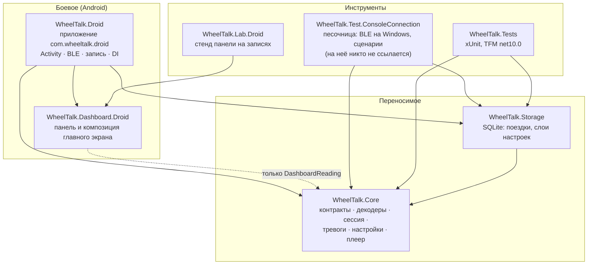
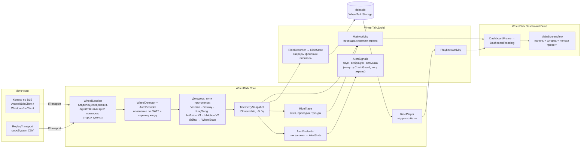
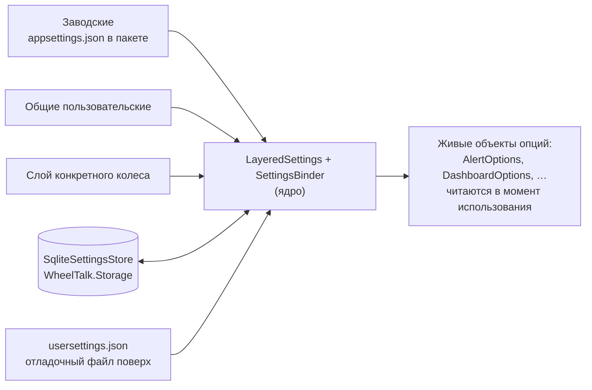

# Архитектура — карта проектов и поток данных

> Снимок на 01.08.2026, по ревью архитектуры ([план 19](android-plan-19-ui-seams.md)).
> При расхождении с кодом прав код; сюда вносить правки тем же коммитом, что двигает границы.

## Проекты и зависимости

Стрелка — «ссылается на». Ядро не знает ни про Android, ни про Windows, ни про SQLite —
это проверяется компилятором (TFM `net10.0` без платформенных суффиксов).

Ключевое свойство: **`Dashboard.Droid` не знает про сессию, транспорт и базу** — панель кормят
record'ом `DashboardReading`, и поэтому один и тот же класс экрана (`Screen/MainScreenView`)
показывают и боевое приложение, и стенд на записанной поездке.

## Поток данных: от байтов до экрана

Команды идут обратным ходом: шторка → `WheelSession.SendCommand` → `SequentialWriteQueue`
(одна GATT-запись в полёте) → декодер строит кадр протокола → транспорт. Отказ без связи —
исключение, а не молчаливый успех.

## Настройки — три слоя

Пороги тревог панель читает **источником**, а не копией: `DashboardOptions.Thresholds` — это
интерфейс `IDashboardThresholds` (план 19 Б3); приложение отдаёт реализацию поверх живого
`AlertOptions`, стенд крутит мутабельное умолчание своими ручками. Тем же приёмом след поездки
читает сглаживание (`RideTrace.SmoothingSecondsSource`, план 19 Б5) — зеркалирования по кадру
нет нигде.

## Где проходит граница «логика — показ»

| Решение | Кто принимает | Экран делает |
|---|---|---|
| Фазы связи (5 штук) | `LinkStatus.Evaluate` (ядро, тесты) | перевод в тексты и цвета |
| Свежесть кадра, вуаль | `LinkStatus.IsStale` | присваивание `IsStale` |
| Тревога, интенсивность | `AlertEvaluator` (ядро, тесты) | полосы, звук, вибрация |
| Пики и тренды поездки | `RideTrace` (ядро, тесты) | стрелки и бирки на лентах |
| Повторы подключения | `WheelSession` (ядро, тесты) | ничего — только смотрит `State` |
| Причина «подключиться нечем» | `LinkProblem` + `LinkStatus` (ядро, тесты) | тексты из `AppStrings`, деталь отказа — из исключения |
| Режим реплея | `ITransport.IsReplay` (контракт, план 19 Б1) | читает свойство, конкретных транспортов не знает |
| Покадровый хром панели: моргание, вуаль, наклон | `PanelDriver` (библиотека, план 19 Б2) | экран отвечает на вопросы `IPanelSource` |
| Состав шторки | `MainActivity` — осознанно (план 19 §3: лямбды по живым объектам, выделение не окупается) | — |
