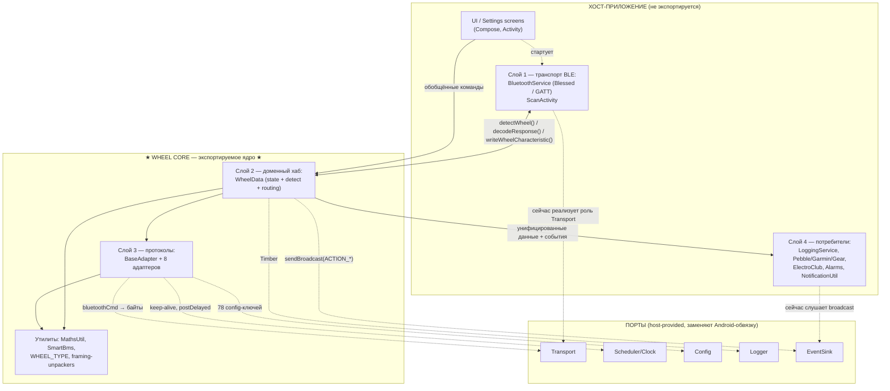
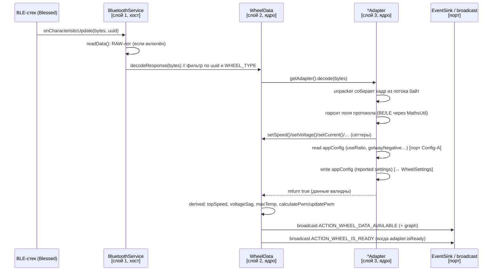
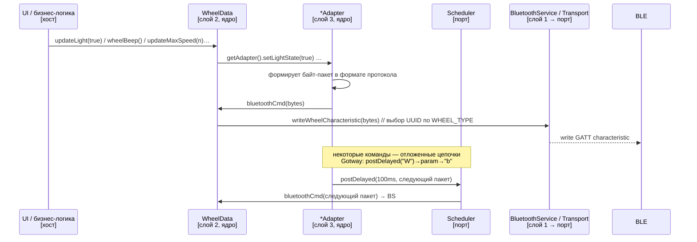
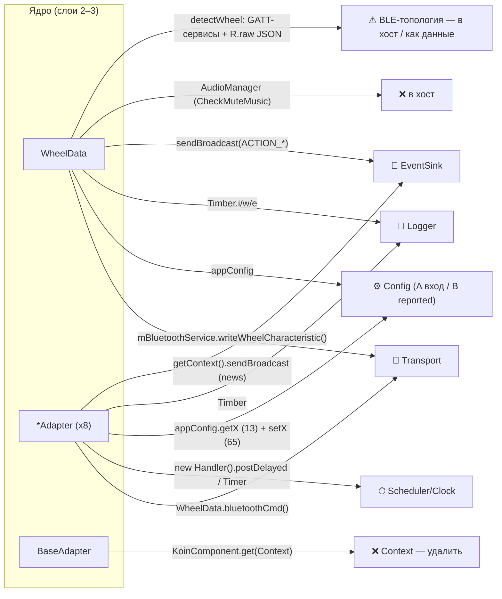
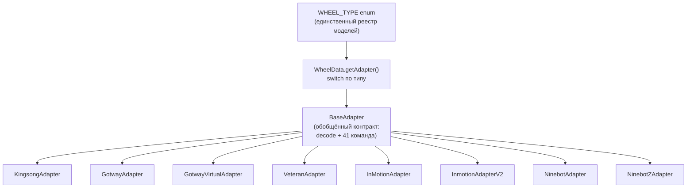
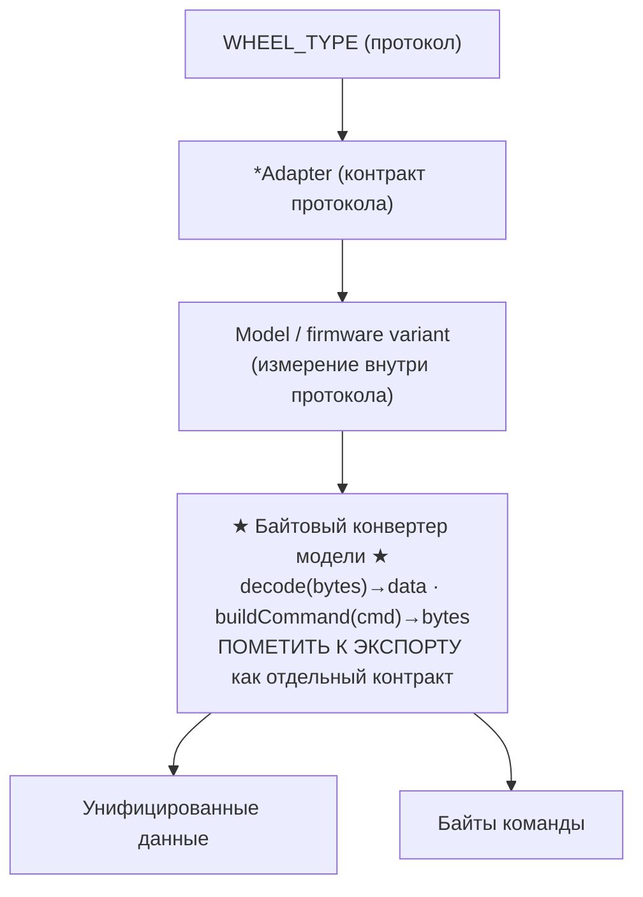

> **Архив (30.07.2026).** Снимок устройства ядра оригинального WheelLog; как описание upstream точен (числа сверены), как проектный документ роль выполнил. Наша сторона устроена иначе: два декодера вместо восьми, `WheelType`+`WheelProtocol` вместо одного enum, `TimeProvider` вместо порта Clock. Ссылки `../app/...` ведут в репозиторий Wheellog.Android.

# Текущая архитектура логики взаимодействия с колесом — в контексте экспорта ядра

> **Назначение:** подробное описание и схемы **текущей** логики WheelLog.Android на участке
> «бизнес-логика взаимодействия с колесом», который планируется экспортировать и переиспользовать
> в новых приложениях (C++ для embedded, C# для собственного приложения).
> Это часть общей задачи экспорта — см. [wheel-core-extraction-task.md](wheel-core-extraction-task.md)
> и карту BLE-подсистемы [bluetooth-architecture.md](bluetooth-architecture.md).
>
> **Цель — переиспование как есть, а не переписывание.** Документ фиксирует, что именно берётся,
> как оно связано с Android-обвязкой, и какие ровно 5 точек связи надо заменить портами, чтобы
> тот же код (или его прямой перенос) заработал вне Android. Тесты не запускаются — существующие
> `*AdapterTest.kt` служат лишь справочником ожидаемого поведения протоколов.

---

## 1. Общая картина одним взглядом

Логика организована в 4 слоя. **Экспортируемое ядро — слои 2 и 3** (плюс чистые утилиты).
Слой 1 (реальный BLE) и слой 4 (потребители) остаются в хосте.

Пунктир = связи, которые сегодня жёстко завязаны на Android и должны быть заменены портами.

---

## 2. Слои и их роль в контексте экспорта

### Слой 1 — Транспорт BLE (`BluetoothService`) — **остаётся в хосте**
`android.app.Service` поверх библиотеки Blessed. Делает физический ввод-вывод GATT:
- принимает байты (`onCharacteristicUpdate` → `readData()`) и отдаёт их в ядро (`WheelData.decodeResponse`);
- пишет готовые байт-команды в колесо (`writeWheelCharacteristic`), выбирая нужный
  `SERVICE_UUID/CHARACTERISTIC_UUID` по `WHEEL_TYPE`;
- ведёт жизненный цикл: connect/disconnect/reconnect, keep-alive-watchdog, звуки, wakelock.

**В контексте экспорта:** это референс того, что должен делать порт **Transport**. На embedded и .NET
он пишется заново под конкретный BLE-стек. Роутинг записи по UUID — это метаданные протокола, их надо
поднять из `BluetoothService` в описание протокола внутри ядра.

### Слой 2 — Доменный хаб (`WheelData`) — **ядро, но требует расщепления**
God-object (1464 строки, singleton). Совмещает 5 обязанностей:
1. **Состояние телеметрии** — ~60 приватных полей + геттеры/сеттеры (fixed-point 1/100).
2. **Распознавание протокола** — `detectWheel()`: сопоставление набора GATT-сервисов с JSON-шаблонами → `WHEEL_TYPE`.
3. **Маршрутизация команд** — десятки `updateX()`-прокси, делегирующих в `getAdapter()`.
4. **Производные расчёты** — PWM, battery %, charge time, средние скорости, remaining distance.
5. **Оповещение хоста** — `sendBroadcast(ACTION_*)` + AudioManager (`CheckMuteMusic`).

**В контексте экспорта:** обязанности 1, 3, 4 — чистое ядро; 2 — частично (байтовая часть в ядре,
GATT-топология в хосте); 5 — заменяется портом EventSink, AudioManager целиком в хост.

### Слой 3 — Протоколы (`BaseAdapter` + 8 адаптеров) — **сердце экспорта**
`BaseAdapter` — обобщённый контракт: `decode(bytes): Boolean` (обязателен) + 41 `open fun`-команда
(по умолчанию no-op; каждый адаптер переопределяет поддерживаемое). Реализации — по одной на протокол:

| Адаптер | WHEEL_TYPE | Строк | Особенности |
|---|---|---|---|
| KingsongAdapter | KINGSONG | 713 | extended-фреймы (MTU) |
| GotwayAdapter | GOTWAY | 875 | BMS, PID (Alexovik-FW), детект по префиксам байт |
| GotwayVirtualAdapter | GOTWAY_VIRTUAL | 38 | тонкая обёртка над Gotway |
| VeteranAdapter | VETERAN | 443 | версии протокола (hw-PWM с v2) |
| InMotionAdapter | INMOTION | 1363 | CAN-сообщения, keep-alive 200/25мс, пароль |
| InmotionAdapterV2 | INMOTION_V2 | 2529 | самый крупный, keep-alive 100/25мс |
| NinebotAdapter | NINEBOT | 714 | proto S2/Mini, keep-alive 0/25мс |
| NinebotZAdapter | NINEBOT_Z | 1342 | keep-alive 200/25мс |

**В контексте экспорта:** это код, который переносится 1:1. Проблемы: (а) синглтоны + мутабельное
внутреннее состояние (у Gotway: `trueVoltage/trueCurrent/bmsCurrent/attempt/lock_Changes/model/fw/…`),
(б) прямые вызовы `WheelData.getInstance()`, `appConfig`, `Timber`, `Handler`, статические `stopTimer()`.

### Слой 4 — Потребители — **остаются в хосте**
`LoggingService`, `PebbleService`, `GarminConnectIQ`, `GearService`, `ElectroClub`, `Alarms`,
`NotificationUtil`. Читают `WheelData.getInstance()` и/или слушают broadcast. Зависимость
**односторонняя** (слой 4 → читает ядро), что упрощает вынос. В новом приложении они подписываются
на порт **EventSink**.

---

## 3. Поток данных: приём телеметрии (wheel → app)

Ключевое для экспорта: `decode()` — **чистое преобразование** «байты → обновление состояния + факт
валидности». Всё, что после `return true` (derived + broadcast) — тоже ядро, кроме самой доставки
события (порт EventSink) и AudioManager (`CheckMuteMusic` — в хост).

---

## 4. Поток данных: отправка команды (app → wheel)

И **keep-alive** (InMotion/InMotion V2/Ninebot/NinebotZ): `detectWheel()` при распознавании запускает
периодический таймер (`scheduleAtFixedRate`, период 25мс), который шлёт служебные пакеты через тот же
`bluetoothCmd → writeWheelCharacteristic`; `BluetoothService.onDisconnected` его останавливает.
Оба механизма (отложенные цепочки и keep-alive) — часть протокола, моделируются портом **Scheduler**.

---

## 5. Связи ядра с Android-обвязкой (что именно рвём)

Сводка точек связи (по количеству — из грепа):

| Точка связи | Где | Масштаб | Заменить на |
|---|---|---|---|
| `WheelData.getInstance().bluetoothCmd()` / `mBluetoothService` | все адаптеры, WheelData | циклическая связь L1↔L2 | порт **Transport** |
| `appConfig.getX` | адаптеры | **13 ключей** — параметры парсинга | порт **Config (A)** |
| `appConfig.setX` | адаптеры | **65 ключей** — отражённые настройки колеса | структура **WheelSettings** в данных |
| `new Handler().postDelayed`, `Timer/TimerTask` | Gotway (9×Handler), InMotion*/Ninebot* keep-alive | тайминги протокола | порт **Scheduler/Clock** |
| `Timber.i/w/e` | везде (Ninebot Z: 66, InMotionV2: 50…) | логирование | порт **Logger** (на embedded — no-op) |
| `sendBroadcast(Constants.ACTION_*)` | WheelData, Gotway (news) | 6 событий | порт **EventSink** |
| `KoinComponent.get(Context)` | BaseAdapter, WheelData | DI | удалить, вносить через порты |
| `AudioManager`, звуки | WheelData `CheckMuteMusic`, BluetoothService | Android media | целиком в хост |
| `detectWheel()` GATT+JSON | WheelData | BLE-топология | хост даёт «тип-кандидат» / описание сервисов как данные |
| синглтоны `getInstance()`, статич. `stopTimer()` | WheelData, все адаптеры | глобальное состояние | экземпляр `WheelCore`, поля вместо статики |

---

## 6. Реестр протоколов и обобщённый контракт

**Требование пользователя:** все конкретные модели/протоколы **экспортируются отдельно** (реестр
`WHEEL_TYPE` → конкретный протокол остаётся публичным), но хост работает с ними через **единый
обобщённый контракт**: сверху — унифицированные данные (`TelemetrySnapshot`) и обобщённые команды
(union из 41 метода `BaseAdapter` + протокол-специфичные расширения). Добавление новой модели =
новое значение enum + новый адаптер (+ описание сервисов) — паттерн сохраняется при экспорте.

---

## 7. Что берётся в экспорт как есть, и что требует работы

| Компонент | Готовность к переносу | Действие |
|---|---|---|
| `MathsUtil` (BE/LE, clamp, byte-хелперы) | ✅ чистые функции | перенос 1:1 (следить за endianness явно) |
| `SmartBms` | ✅ модель данных | перенос 1:1 |
| `WHEEL_TYPE` | ✅ enum | перенос 1:1 |
| Логика `decode()` каждого адаптера | 🟡 чистая по сути | убрать `getInstance()/appConfig/Timber` за порты |
| Формирование команд в адаптерах | 🟡 | вернуть байты через Transport вместо `bluetoothCmd()` |
| keep-alive / отложенные цепочки | 🟡 тайминги протокола | смоделировать через Scheduler |
| Состояние адаптера | 🔴 статика/синглтон | сделать полями экземпляра |
| `WheelData` God-object | 🔴 | расщепить: `TelemetryState` / `DerivedCalc` / `Detector` / `CommandRouter` |
| `detectWheel()` (GATT+JSON) | 🔴 Android-топология | байтовую часть — в ядро, GATT-часть — в хост |
| derived-расчёты (PWM/battery/charge) | 🟡 | вынести в чистые функции с fixed-point |

Легенда: ✅ как есть · 🟡 срезать зависимости · 🔴 требует рефакторинга структуры.

**Рекомендованный порядок:** взять **Gotway** как эталонный вертикальный срез (уже задокументирован
формат кадров, средний размер, богатая логика — BMS/PID/детект по байтам), провести через все
изменения, затем размножить паттерн на остальные 7 протоколов.

---

## 7-bis. Байтовые конвертеры конкретных моделей — явно экспортируемые контракты

**Важно:** экспортируется не только 8 адаптеров-протоколов, но и **байтовые конвертеры для конкретных
моделей/прошивок колёс** внутри них. Это и есть «контракты» — функции преобразования
`байты ⇄ унифицированные данные/команды`, специфичные для конкретной модели. Каждый такой конвертер
должен быть **помечен к экспорту как первоклассная единица** (публичная, переиспользуемая, тестируемая
отдельно), а не оставаться скрытой веткой `if` внутри монолитного `decode()`.

Почти каждый протокол несёт внутри себя измерение «конкретная модель / вариант прошивки», от которого
зависит разбор байт:

| Протокол (адаптер) | Конкретные модели / варианты прошивки (влияют на конверсию байт) | Где в коде |
|---|---|---|
| **Gotway/Begode** | прошивки: `Begode`, `ExtremeBull`, `Freestyl3r`, `SmirnoV` (SV/Alexovik-FW) — ветвление разбора по `bIsAlexovikFW`, разные формулы температуры/тока/PWM | [GotwayAdapter.java:62-96, 119-360](../app/src/main/java/com/cooper/wheellog/utils/GotwayAdapter.java) |
| **Veteran** | версии протокола (`ver`, hw-PWM с v2+) — разбор зависит от версии | [VeteranAdapter.java:48-50](../app/src/main/java/com/cooper/wheellog/utils/VeteranAdapter.java) |
| **Ninebot** | `S2` / `Mini` / базовый — `protoVersion` меняет формат пакетов и команд | [NinebotAdapter.java:25-28, 274-526](../app/src/main/java/com/cooper/wheellog/utils/NinebotAdapter.java) |
| **Ninebot Z** | адресация BMS1/BMS2, CAN-сообщения | [NinebotZAdapter.java:526](../app/src/main/java/com/cooper/wheellog/utils/NinebotZAdapter.java) |
| **InMotion** | `enum Model` (V8, V8F/S, V10/V10F/S/T…, Glide3…) + input-type таблицы — модель определяет масштабы и наличие полей | [InMotionAdapter.java:186-262, 501-519](../app/src/main/java/com/cooper/wheellog/utils/InMotionAdapter.java) |
| **InMotion V2** | `enum Model` (series + type) | [InmotionAdapterV2.java:107-180, 568](../app/src/main/java/com/cooper/wheellog/utils/InmotionAdapterV2.java) |
| **Kingsong** | модели `KS-18L`, `KS-16X`, `KS-S18`, `KS-S20/S22`, `KS-F22P`, `KS-F18P`, `KS-S19`… — feature-ветвления и коррекции (напр. km-фикс для 18L) | [KingsongAdapter.java:468-490, 559](../app/src/main/java/com/cooper/wheellog/utils/KingsongAdapter.java) |

**Что это значит для экспорта/порта:**
- Публичная поверхность = реестр `WHEEL_TYPE` → адаптер протокола → набор конвертеров конкретных моделей.
  Все три уровня видимы и переиспользуемы хостом (можно взять как весь протокол, так и конкретный
  конвертер модели).
- На фазе извлечения (см. задачу) при разбиении `decode()` на чистые функции **выделять конвертер
  каждой модели/прошивки в самостоятельную единицу** с явным контрактом
  `decode(state, bytes) -> (state, telemetry)` и `buildCommand(cmd) -> bytes`, помеченную как
  экспортируемую. Общий обобщённый контракт данных/команд сверху сохраняется единым.
- В C++/C# это ложится как: интерфейс/трейт конвертера + реализация на модель; реестр протокол→модель
  остаётся публичным API.

---

## 8. Итоговая граница экспорта (сводка)

**Экспортируется (Wheel Core):** слои 2–3 + утилиты — реестр `WHEEL_TYPE`, 8 адаптеров-протоколов,
**байтовые конвертеры конкретных моделей/прошивок внутри них (контракты `decode`/`buildCommand`,
помечены к экспорту как отдельные единицы — см. §7-bis)**, framing-unpackers, `MathsUtil`, `SmartBms`,
состояние телеметрии, derived-расчёты, байтовая часть распознавания.

**Верхний контракт (host ⇄ core):** обобщённые команды вниз, унифицированные данные + события вверх.

**Нижний контракт (порты, реализует хост):** Transport, Scheduler/Clock, Config (A вход + B reported), Logger, EventSink.

**Остаётся в хосте:** реальный BLE (слой 1), потребители (слой 4), AudioManager/звуки, GATT-топология распознавания, UI.

> Дальнейшие шаги и артефакты (спецификация границы, классификация 78 config-ключей, схема каталога
> модуля) — в [wheel-core-extraction-task.md](wheel-core-extraction-task.md).
